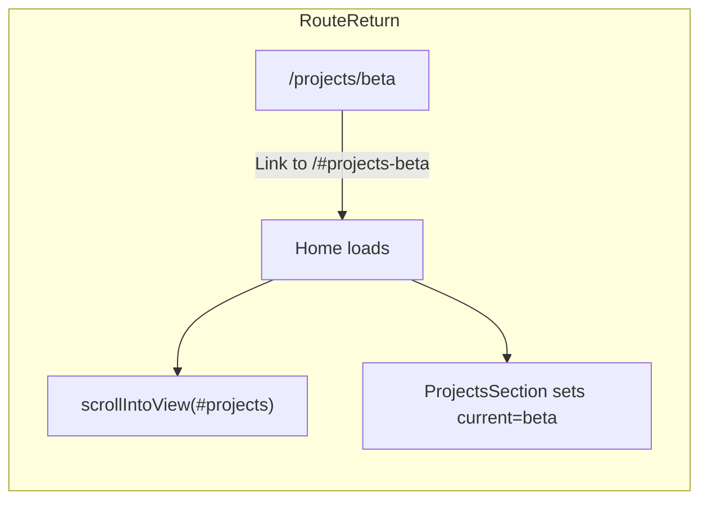

# From-scratch blueprint: current final portfolio

## Outcome definition

Ship a single-page portfolio with a pinned **scanner hero**, **holographic project carousel**, **case-study detail pages**, **timeline experience**, **GPA dial education UI**, **radial contact hub**, **global custom cursor**, and **hash-aware navigation** so returning from `/projects/[id]` recenters the correct project card.

**Viewport:** **Desktop-first.** The shipped layout targets wide screens; some Tailwind breakpoints (`sm` / `md` / `lg`) and `max-w-[95vw]`-style constraints exist, but small screens are not fully adapted (inline navbar, fixed-width carousel cards, absolutely positioned hero HUD cards, two-column timeline). Treat **full mobile responsiveness** as follow-up work if you need parity on phones—see **Viewports / mobile** at the end.

## Phase 0 — Project bootstrap

- Create Next.js App Router + TypeScript + Tailwind.
- Add dependencies: `gsap`, Lenis wrapper if used ([`src/components/SmoothScroll.tsx`](src/components/SmoothScroll.tsx) pattern).
- Establish fonts in [`src/app/globals.css`](src/app/globals.css) (Google fonts import already used): **Orbitron** for display, **IBM Plex Mono** for HUD labels.

## Phase 1 — Global HUD design system

In [`src/app/globals.css`](src/app/globals.css), define:

- CSS variables: `--background`, `--teal`, glow tokens (`--teal-glow`, `--teal-glow-strong`).
- Utilities: `.bg-grid`, `.text-glow`, `.holo-card`, `.holo-scanlines`, `.hud-blink`, `.animate-pulse-glow`.
- Connector primitives used by hero bio cards and contact section (folder tab/body, connector gradients).
- Hide native cursor on desktop experience: `body { cursor: none; }` plus interactive elements also `cursor: none` to match custom cursor.

## Phase 2 — App shell: scroll + global overlays

In [`src/app/layout.tsx`](src/app/layout.tsx):

- Wrap page content with smooth scrolling component.
- Mount **CustomCursor** globally (dynamic import SSR off via [`src/components/ClientOnly.tsx`](src/components/ClientOnly.tsx)).
- Mount **ChatBot** outside the scroll tree so pinned sections do not steal clicks.

This is what makes cursor/chat consistent on `/` and `/projects/[id]`.

## Phase 3 — Data contracts (build UI on stable types)

In [`src/lib/projects.ts`](src/lib/projects.ts):

- `Project`: include carousel fields (`id`, `name`, `tools`, `description`, `link`, `color`) plus case-study narrative fields (`background`, `research`, `implementation`, `result`, `reflection`).
- `Experience`, `Education` (include `gpa?`, optional `gradLabel?`), `contactLinks` with `angle` metadata for radial layout.
- Seed realistic placeholder copy so every route renders complete content on first pass.

## Phase 4 — Home composition + hash landing

In [`src/app/page.tsx`](src/app/page.tsx):

- Compose sections in final order: Navbar → HeroScanner → Projects → Experience → Education → Contact.
- Add a client `useEffect` hash handler:
  - If hash starts with `#projects-`, scroll to `#projects` (not the literal id-only fragment), after `requestAnimationFrame` to survive pinned layout.

## Phase 5 — Hero scanner (scroll narrative)

Implement [`src/components/HeroScannerSection.tsx`](src/components/HeroScannerSection.tsx):

- Pin section with GSAP ScrollTrigger (`pin: true`, long scroll distance).
- Timeline beats:
  - hero title fade/zoom away
  - desk image zoom + glitch + flash crossfade into scanner
  - scan line sweep + percent counter + circular stroke gauge
  - staged reveal of folder-style bio cards (connectors + dots)
  - scan complete pulse
  - optional skill-tag scatter toward project panel positions
- Keep overlays `pointer-events-none` except where you intentionally want interaction.

## Phase 6 — Projects carousel (center focus)

Implement [`src/components/ProjectsSection.tsx`](src/components/ProjectsSection.tsx):

- Maintain `current` index state.
- Map each index to `left | center | right | hidden` with perspective transforms + mask fade for side cards.
- Controls: drag threshold, chevrons, dot pagination.
- Each card: `FILE #NNN`, tool chips, `VIEW` link to `/projects/[id]`.
- ScrollTrigger entrance animation for stage.

## Phase 7 — Project detail pages

Add [`src/app/projects/[id]/page.tsx`](src/app/projects/[id]/page.tsx):

- `generateStaticParams` from projects array.
- Sticky header: back link + title + status dot.
- Tools chips row.
- Five phases rendered from `PHASES` constant + `project[phaseKey]` content.
- Bottom nav: `All Projects` link behavior (per your final spec: home hash `#projects-alpha` / first id).

Add [`src/app/projects/[id]/PhaseTracker.tsx`](src/app/projects/[id]/PhaseTracker.tsx):

- IntersectionObserver to highlight active phase dot.
- Anchor links to `#phase-*` sections.

## Phase 8 — Hash focus restoration (two-part system)

This is required for the “return to projects with same project centered” UX.

1. Home page: normalize `#projects-*` hash to scroll `#projects` ([`src/app/page.tsx`](src/app/page.tsx)).
2. Carousel: parse `#projects-{id}` and `setCurrent(idx)` on mount + `hashchange` ([`src/components/ProjectsSection.tsx`](src/components/ProjectsSection.tsx)).

## Phase 9 — Experience timeline

Implement [`src/components/ExperienceSection.tsx`](src/components/ExperienceSection.tsx):

- Center timeline SVG line with stroke draw animation.
- Alternating cards with bracket corners + HUD meta labels.
- Scroll-driven card reveals.

## Phase 10 — Education section (final dial design)

Implement [`src/components/EducationSection.tsx`](src/components/EducationSection.tsx):

- Compact GPA dial SVG: segmented outer ring, tick ticks, GPA arc in outer annulus (avoid overlapping numerals).
- Connector polyline: **45° up** then **horizontal** to endpoint node; node visually targets university title block.
- Text hierarchy: school name, degree directly under, field, highlights with custom triangle bullets.
- Scroll-driven row reveal + arc stroke animation; `N/A` fallback when no GPA.

## Phase 11 — Contact hub

Implement [`src/components/ContactSection.tsx`](src/components/ContactSection.tsx):

- Large SVG “radar” with rings/arcs/ticks/dot arcs.
- Elbow connectors from outer ring to endpoint nodes + labels positioned at connector ends.
- GSAP scrub timeline for drawing rings/connectors/labels; slow ambient rotation for depth.

## Phase 12 — Navbar polish

Implement [`src/components/Navbar.tsx`](src/components/Navbar.tsx):

- left brand (`J.DOE`) + `SYSTEM ONLINE` under brand.
- iconified section links.
- About uses special scroll-to-scan-complete behavior (tuned to pinned hero timeline).

## Phase 13 — Global interaction polish

- [`src/components/CustomCursor.tsx`](src/components/CustomCursor.tsx): GSAP follow + hover scale on links/buttons.
- Verify chatbot UI matches HUD tokens ([`src/components/ChatBot.tsx`](src/components/ChatBot.tsx)).

## Gemini-powered assistant (API + env)

The floating chat panel calls a **server route** that uses Google’s Gemini API; it does not embed the key in the client.

- **Route:** [`src/app/api/chat/route.ts`](src/app/api/chat/route.ts) — `POST` with a `messages` array; reads `process.env.GEMINI_API_KEY` via `@google/generative-ai`.
- **Client:** [`src/components/ChatBot.tsx`](src/components/ChatBot.tsx) — `fetch("/api/chat", …)`.
- **Local:** add `.env.local` (gitignored) with `GEMINI_API_KEY=your_key`. Get a key from [Google AI Studio](https://aistudio.google.com/apikey).
- **Production:** set `GEMINI_API_KEY` in your host’s environment (e.g. Vercel → Project → Settings → Environment Variables). Never commit the key.
- **Without a key:** the API responds with an error payload; the UI should degrade gracefully for end users.

## Phase 14 — QA + docs

- Run `npm run build` after each major milestone.
- Manual checks: `/` section navigation, carousel interactions, `/projects/[id]` navigation, back links, hash reload, cursor visibility on both routes.
- Update [`README.md`](README.md) with stack, structure, navigation behavior notes.

## Viewports / mobile (honest current state)

**Not fully mobile-responsive as shipped.** Sections use fixed pixel widths, large horizontal transforms (carousel), and absolute offsets tuned for desktop. A proper mobile pass would typically include: hamburger or bottom nav, single-column timeline, scaled or stacked project cards, reflowed hero scanner / bio cards, and touch-friendly hit targets (and revisiting `cursor: none` on `body` for touch devices).

## Execution order (fastest path to “looks like final”)

1. globals + layout overlays
2. data contracts
3. home scaffold + hash normalization
4. hero scanner
5. projects carousel + detail route
6. hash focus restoration
7. experience + education + contact
8. navbar polish + README + final QA
9. (Optional) Mobile / narrow viewport pass — see **Viewports / mobile**
